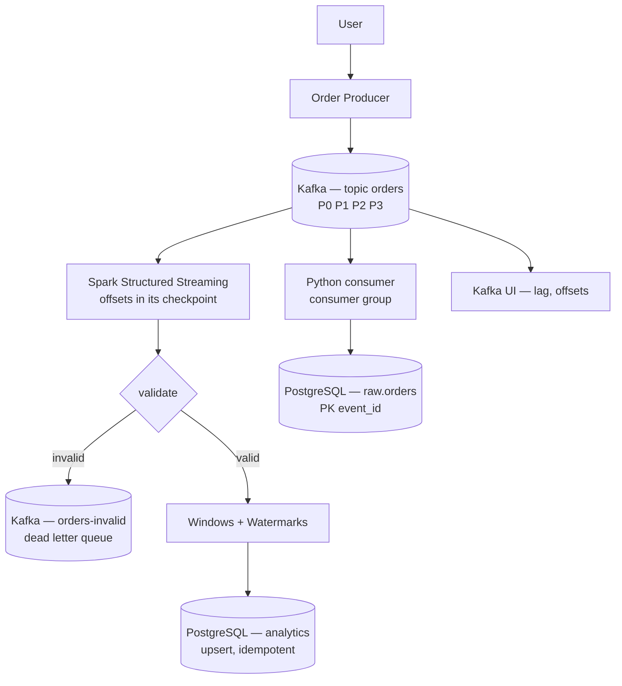

# Kafka Streaming Pipeline — Real-time e-commerce orders

> **Streaming data engineering pipeline**: every order becomes an **event**
> published to Kafka, consumed in parallel by Spark Structured Streaming
> (windowed analytics) and by a Python consumer (persistence), with PostgreSQL
> as the destination.

[](https://github.com/AymanMady/kafka-streaming-pipeline/actions/workflows/ci.yml)
[](https://www.python.org/)
[](https://kafka.apache.org/)
[](https://www.postgresql.org/)
[](LICENSE)

**Status: complete, phases 1–20.** Kafka (KRaft), producer, consumer,
partitioning, consumer groups, offsets and replay, then Spark Structured
Streaming: windows, watermarks, checkpoints, idempotent writes to PostgreSQL,
monitoring and load testing.

Every number in this README was **measured** on the development machine
(8 vCPU, ~8 GB of RAM, a single broker and a 2-core Spark worker). None of
them is an estimate.

---

## 1. Project overview

This project builds an **event-driven** processing chain, step by step:

```
Event  →  Kafka  →  Consumers  →  Immediate processing  →  Analytics
```

Where a batch pipeline waits (an hour, a night) to collect a chunk of data
before processing it, a streaming pipeline handles **every event as it
arrives**. The goal is not just to get code that runs, but to understand *why*
each component exists: partitions, offsets, consumer groups, watermarks,
checkpoints, idempotency.

## 2. Business problem

An e-commerce platform records orders continuously. The business team needs,
**without waiting for tomorrow's batch**:

- last-minute revenue, by country;
- order count and average basket in near real time;
- immediate detection of invalid orders (negative amount, null `order_id`);
- the ability to **replay** history when a calculation turns out to be wrong,
  without asking the source application for the data again.

A plain `INSERT` into PostgreSQL from the application does not answer those
needs (see [Kafka vs Database](#5-kafka-vs-database)).

## 3. Architecture



The key point: **two independent consumers read the SAME topic**. Spark and
the Python consumer each have their own read position; one can fall behind,
crash or replay history without affecting the other. That is the decoupling
Kafka brings and that a database alone does not.

They do not track that position the same way, and the difference matters:
the Python consumer commits its offsets **to Kafka** (so `make lag` sees it),
while Spark keeps them in **its own checkpoint** — which is precisely what
makes a Spark query independent of the broker's bookkeeping.

### Deployed services

| Service        | Role                                            | Host port | Phase |
|----------------|-------------------------------------------------|-----------|-------|
| `kafka`        | Single broker, **KRaft** mode (no ZooKeeper)    | `9092`    | 1     |
| `kafka-ui`     | Topics, partitions, offsets, **consumer lag**   | `8085`    | 1     |
| `postgres`     | Analytics destination (`raw`, `analytics`)      | `5441`    | 1     |
| `spark-master` | Allocates the resources. Computes nothing.      | `8092`    | 8     |
| `spark-worker` | 2 cores / 2 GB, runs the executors              | `8093`    | 8     |
| `spark-app`    | The client: hosts the **driver** of the jobs    | `4041`    | 8     |

> The ports are shifted on purpose: `5432`, `5433`, `5434`, `5440`, `8080`,
> `8081`, `8082`, `8088`, `8090`, `8091` and `4040` are already taken by the
> other projects in this series. Everything is configurable in `.env`.
>
> `make up-core` starts only Kafka, its UI and PostgreSQL, for when the
> machine is busy and Spark is not needed yet.

## 4. Batch vs streaming

```
BATCH                          STREAMING
Data                           Event
  ↓                              ↓
Wait  (1h, a night)            Kafka
  ↓                              ↓
Process (the whole chunk)      Process (on arrival)
  ↓                              ↓
Result                         Result
```

| Criterion              | Batch                                  | Streaming                             |
|------------------------|----------------------------------------|---------------------------------------|
| Latency                | minutes → hours                        | seconds                               |
| Operational cost       | low (one job, one schedule)            | high (a 24/7 service to watch)        |
| Recovery from failure  | simple: rerun the job                  | complex: offsets, checkpoints, state  |
| After-the-fact fixes   | natural (recompute everything)         | hard (the state has already been emitted) |
| Ideal case             | daily reports, ML, reconciliation      | alerting, fraud, stock, live ops      |

**Streaming is not "better" than batch.** It costs more in complexity and in
operations. You use it when the **freshness of the data has business value**. A
monthly financial report has no reason to be streamed. Most serious platforms
run both, and batch often acts as the **safety net** that recomputes the
reference truth (the so-called Lambda architecture).

## 5. Kafka vs database

Why not simply do `Application → PostgreSQL`?

```
WITHOUT KAFKA                       WITH KAFKA
App ──> PostgreSQL                  App ──> Kafka ──┬──> Spark ──> PostgreSQL
 │       │                                          ├──> Python consumer
 └─ tight coupling                                  ├──> Fraud service
    (if the database goes down,                     └──> Data Lake
     the app goes down)
```

| Property         | What Kafka brings                                                                          |
|------------------|--------------------------------------------------------------------------------------------|
| **Decoupling**   | The app publishes without knowing who reads. Adding a consumer does not touch the producer. |
| **Buffering**    | Traffic spike or slow database: messages pile up in Kafka instead of being lost.            |
| **Replay**       | Kafka is a **log**: the message stays after being read (7 days here). You can re-read from offset 0. |
| **Scalability**  | Partitions make consumption horizontally parallel.                                          |
| **Multi-consumer** | Each consumer group has its own offsets: they read the same data without interfering.     |
| **Resilience**   | If PostgreSQL is down for 10 minutes, nothing is lost: it catches up afterwards.            |

The fundamental difference: a database stores a **state** ("the balance is
250"), Kafka stores **facts** ("+100 at 10:00", "+150 at 10:02"). A state gets
overwritten; a fact does not. That is what makes replay possible.

---

## 6. Installation

Requirements: Docker + Docker Compose v2, `make`, and Python 3.10+.

```bash
git clone https://github.com/AymanMady/kafka-streaming-pipeline.git
cd kafka-streaming-pipeline
make setup          # creates .env from .env.example
# edit .env: POSTGRES_PASSWORD, and the ports if needed
make build          # builds the Spark image (~3 min the first time)
make up             # starts kafka + kafka-ui + postgres + spark
make check          # checks end to end that everything answers
make topics         # creates the orders / orders-invalid topics
make db-migrate     # creates raw.orders and the analytics tables
```

Then produce and consume:

```bash
make spark-shell    # a terminal inside the client container
python3 src/producer/order_producer.py --rate 10 --invalid-rate 0.1
python3 src/consumer/order_consumer.py --sink postgres
```

Or from your own machine, in a virtualenv (Kafka is reachable on
`localhost:9092`, PostgreSQL on `localhost:5441`):

```bash
python3 -m venv .venv && source .venv/bin/activate
pip install -r requirements.txt
python src/producer/order_producer.py --rate 10
```

## 7. Useful commands

```bash
make help          # every command, with its description
make build         # build the Spark image
make up            # start everything            make up-core   # without Spark
make ps            # container status            make logs      # all the logs
make check         # full check (scripts/check_stack.sh)
make topics        # create the topics (idempotent) and show their anatomy
make db-migrate    # apply sql/*.sql (idempotent, replayable)
make kafka-info    # cluster identity + effective broker config
make kafka-shell   # shell inside the Kafka container
make spark-shell   # shell inside the Spark client container (the driver)
make psql          # PostgreSQL SQL console
make ui            # open Kafka UI        make spark-ui    # open the Spark UIs
make down          # stop (data is kept)
make clean         # DESTRUCTIVE: drops the PG volume + the Kafka segments
```

**The streaming jobs** (`ARGS="..."` is passed straight through):

```bash
make stream-raw        ARGS="--from-beginning --show-payload"   # phase 9
make stream-validate   ARGS="--from-beginning"                  # phase 10
make stream-analytics  ARGS="--window '30 seconds' --duration 120"
make dlq-tail                                                   # the rejects
make reset-checkpoints                                          # replay from scratch
```

**Demos and measurements** — each turns theory into a number:

```bash
python3 scripts/demo_partitioning.py     # key -> partition, computed then verified
python3 scripts/demo_consumer_groups.py  # real consumers, real rebalancing
make demo-watermark                      # what a watermark accepts, and drops
make lag          ARGS="--watch 5"       # consumer lag per partition
make load-test    COUNT=50000 ARGS="--steps 1000,10000,0"
make test                                # 52 pytest tests
```

---

## 8. The streaming pipeline

```
orders topic ──► parse + validate ──┬──► valid ──► windows + watermark ──► PostgreSQL
                                    └──► invalid ──► orders-invalid (DLQ)
```

### Phase 9 — reading the stream as it is

`make stream-raw` shows what Kafka actually hands Spark, before any parsing:

```text
+------+---------+------+-----------------------+---+-----------+
|topic |partition|offset|kafka_timestamp        |key|value_bytes|
+------+---------+------+-----------------------+---+-----------+
|orders|2        |0     |2026-09-21 13:59:32.876|140|219        |
|orders|2        |1     |2026-09-21 13:59:33.275|154|220        |
```

`key` and `value` are **binary**. Kafka carries bytes and knows nothing about
JSON. Interpreting them is entirely the consumer's job. And the offset only
ever grows **within one partition** — never across the topic.

### Phase 10 — validate, and route the rejects

The rules exist **twice**: in plain Python
([`src/common/schemas.py`](src/common/schemas.py), testable without a cluster)
and in Spark ([`src/streaming/transform.py`](src/streaming/transform.py), which
runs on the stream). A test compares the two verdicts on a corpus of events, so
they cannot drift apart.

Measured on a run with 15% of injected corruptions:

```text
  batch 0 | 3378 events | valid 3311 (98.0%) | rejected 67 -> orders-invalid
+---------------------+-----+
|rule                 |count|
+---------------------+-----+
|amount_negative      |14   |
|missing_order_id     |12   |
|missing_country      |12   |
|timestamp_invalid    |11   |
|currency_unsupported |11   |
|quantity_not_positive|7    |
+---------------------+-----+
```

**Why a dead letter queue and not a `filter()`?** Because a filter is silent.
Three months later, nobody can say what was dropped or why. A DLQ is a topic
like any other: you read it, you count it, you alert on it, and you can replay
it once the producer is fixed. The rejected message keeps its original payload
**and** gains the reason:

```json
{"payload": "{\"order_id\":453,\"quantity\":0,...}",
 "rejection_reasons": ["quantity_not_positive"],
 "source_partition": 0, "source_offset": 891,
 "rejected_at": "2026-09-23T13:15:25.077Z"}
```

**The NULL trap.** In SQL, `NULL > 0` is not `False`, it is `NULL`. Without
care, an event with a missing quantity triggers **no rule at all** and passes
as valid. The framework forces `NULL -> False`:

```python
def _safe(condition):
    return F.coalesce(condition, F.lit(False))
```

It is the single most common way broken data reaches a dashboard, and it has a
dedicated test.

### Phases 11 to 13 — aggregate, window, watermark

We aggregate on **event time** — when the order was *placed* — not on
processing time. A five-minute network outage must not move an afternoon's
revenue into one minute.

Event time then forces a question batch processing never has to ask: **how
long do we keep a window open, waiting for stragglers?**

- no watermark → every window stays open forever → unbounded state, and the
  job eventually dies of memory;
- a watermark → "beyond this lateness we drop" → bounded memory, but data that
  is genuinely lost.

There is no right answer, only a trade-off. `make demo-watermark` makes it
concrete and reproducible:

```text
  max event time seen : T+250s
  watermark now at    : T+130s (max seen - 2 minutes)

  order 101 at T+140s -> AFTER the watermark  -> should be accepted
  order 102 at T+10s  -> BEFORE the watermark -> should be dropped

  Windows emitted (last state of each)
    T+  0s -> T+ 60s | 1 event(s) | orders [1]
    T+ 60s -> T+120s | 1 event(s) | orders [2]
    T+120s -> T+180s | 2 event(s) | orders [3, 101]
    T+180s -> T+240s | 1 event(s) | orders [4]
    T+240s -> T+300s | 1 event(s) | orders [5]

  Order 101 (inside the watermark) : ACCEPTED, its window was re-emitted
  Rows dropped by the watermark    : 1
```

Order 102 appears nowhere. It was not rejected for being invalid — it was
simply **too late**. Spark counts it in `numRowsDroppedByWatermark`, and that
counter belongs on a dashboard: a watermark silently eating data is a bug you
only notice in the numbers.

### Phase 14 — checkpoints

The checkpoint holds **two** things: the Kafka offsets already consumed, and
the **state of the open windows**. Without it, a restart re-reads from
`startingOffsets` and loses every partial window.

Two consequences worth knowing:

- `startingOffsets` only applies the **first** time a query runs. Once a
  checkpoint exists, Spark resumes from it and ignores the option entirely.
  `make reset-checkpoints` is what makes it apply again.
- **one checkpoint per query.** Sharing one between two queries corrupts both.

### Phases 15 and 16 — writing, and writing twice

Structured Streaming has no native "upsert to a relational database" sink: the
built-in JDBC sink only knows append and overwrite. Neither works for a
windowed aggregate, because as long as a window is open a late event changes
its total and Spark **re-emits** the row. With an append, you would get one row
per re-emission and count the same revenue several times.

So the job goes through `foreachBatch`, which hands back a normal batch
DataFrame — and the full SQL vocabulary, `ON CONFLICT DO UPDATE` included.

That is also what makes the pipeline **idempotent**. Structured Streaming
guarantees at-least-once on the sink side: after a crash, a micro-batch can be
replayed. An idempotent write turns at-least-once delivery into an
exactly-once **result**.

Measured — the whole topic replayed from offset 0, with a fresh checkpoint:

| | windows | orders | revenue |
|---|---|---|---|
| after the first run | 48 | 3 311 | 906 712.70 |
| after replaying everything | 48 | 3 311 | 906 712.70 |

The same holds on the consumer side, where `raw.orders` is keyed on
`event_id`:

```text
first run : 300 rows written, 0 duplicates ignored
replay    : 0 rows written, 300 duplicates ignored
```

**The practical lesson: exactly-once is far more often obtained by making the
write idempotent than by a distributed transaction.**

### Phase 17 — lag and monitoring

```
lag = (last offset produced) - (last offset committed by the group)
```

It is the only number that answers "are we keeping up?". Throughput alone does
not: consuming 10 000 events/s while 12 000 are produced still means falling
behind.

```text
  group                        topic            part    current        end      lag
  --------------------------------------------------------------------------------
  order-processing-group       orders              0        755        902      147
  order-processing-group       orders              1        474        581      107
                                                                     TOTAL      254
```

| Lag | Reading |
|---|---|
| stable near 0 | healthy |
| stable but high | keeping up, with a permanent backlog never caught up |
| **growing** | **the alert**: consumption is slower than production |
| falling | catching up after an incident |

A caveat worth knowing: a Spark query does **not** commit its offsets to
Kafka — it tracks them in its own checkpoint, which is exactly what makes it
independent of the broker. So it does not show up in `make lag`. Its own
metrics are persisted to `analytics.stream_metrics` by a
`StreamingQueryListener`, because `StreamingQueryProgress` dies with the query
and you need those numbers the morning *after* an incident.

### Phase 18 — where it saturates

`make load-test` measures throughput **and** latency, because an average hides
the tail: a 5 ms average with a 3 s p99 drops one request in a hundred into a
timeout.

| Target | Achieved | Elapsed | p50 | p95 | p99 | Failed |
|---|---|---|---|---|---|---|
| 2 000/s | 2 000/s | 10.0 s | 4.5 ms | 7.0 ms | 9.0 ms | 0 |
| 10 000/s | 9 995/s | 2.0 s | 3.4 ms | 5.8 ms | 6.5 ms | 0 |
| max | **39 017/s** | 0.5 s | 3.5 ms | 6.7 ms | 9.0 ms | 0 |

20 000 events per step, single broker, `acks=1`, lz4. The producer tracks its
target exactly up to 10 000/s and tops out around 39 000/s. Read it with
`make lag` right after: **the producer can saturate long before the
consumer**, and the two limits are not the same problem.

### Phase 19 — tests

52 tests, on a `local[2]` SparkSession: neither Kafka nor a cluster is needed.

```bash
make test
```

Structured Streaming applies the **same operators** to a stream and to a batch,
which is what makes streaming logic testable at all: the window tests run on a
static DataFrame with hand-picked event times, and the expected result is
computable in your head.

What is tested first is not what is easiest, but where an error is **silent**:
the NULL trap, the window upper bound being exclusive, an empty micro-batch, a
numeric field arriving as text, and the agreement between the Python and the
Spark rule sets.

---

## 9. Progress by phase

- [x] **Phase 1** — Architecture + Docker + Kafka (KRaft) + PostgreSQL
- [x] **Phase 2** — First Kafka topic
- [x] **Phase 3** — Python producer
- [x] **Phase 4** — Python consumer
- [x] **Phase 5** — Partitions + message keys
- [x] **Phase 6** — Consumer groups
- [x] **Phase 7** — Offsets, restart, replay
- [x] **Phase 8** — Spark Structured Streaming (image, cluster, session)
- [x] **Phase 9** — Kafka → Spark
- [x] **Phase 10** — Streaming transformations + dead letter queue
- [x] **Phase 11** — Real-time analytics
- [x] **Phase 12** — Windows
- [x] **Phase 13** — Watermarks
- [x] **Phase 14** — Checkpoints
- [x] **Phase 15** — PostgreSQL sink
- [x] **Phase 16** — Idempotency + fault tolerance
- [x] **Phase 17** — Consumer lag + monitoring
- [x] **Phase 18** — Load testing
- [x] **Phase 19** — Tests
- [x] **Phase 20** — Final README

---

## 10. Concepts — glossary


**Broker** — A Kafka server. It receives messages from producers, writes them
to disk, and serves them to consumers. Here: a single broker (`ksp-kafka`).

**KRaft** — The mode where Kafka manages its own metadata (who the controller
is, which partitions exist, who is leader) in a replicated internal log,
instead of delegating to ZooKeeper. Since Kafka 3.3 it is the recommended mode;
ZooKeeper is removed in Kafka 4.0. One fewer service to deploy and monitor.

**Listener / advertised listener** — A listener is the port the broker listens
on. The *advertised listener* is the address it **announces** to clients. A
Kafka client first connects to ask for metadata, then **reconnects to the
announced address**. That is why this project declares two listeners:
`INTERNAL://kafka:9092` (resolvable between containers) and
`EXTERNAL://localhost:9092` (resolvable from your machine).

**Retention** — How long Kafka keeps a message, **even after it has been
read**. Set to 7 days here. Kafka is not a queue that deletes on consumption:
it is a log with a lifetime.

**Consumer group** — A set of consumers sharing a `group.id`. Within a group,
each partition is assigned to exactly one consumer, so a group's parallelism is
capped by the partition count. Two different groups each receive every message.

**Offset** — A message's position inside a partition. Kafka stores the last
committed offset per (group, partition) in `__consumer_offsets`, which is how a
consumer resumes exactly where it stopped.

**Event time vs processing time** — Event time is when the thing *happened*
(the `timestamp` carried by the event). Processing time is when Spark *saw* it.
Aggregating on processing time makes a network outage look like a revenue
spike; aggregating on event time is what makes the result correct, and what
forces you to deal with lateness.

**Window** — A bucket of event time, identified by its bounds. Here they are
**tumbling** windows: contiguous, non-overlapping, `[start, end)` — the upper
bound belongs to the next window. Getting that wrong double-counts every event
landing exactly on a boundary.

**Watermark** — The limit past which a late event is dropped:
`max event time seen - accepted lateness`. It bounds the memory used by open
windows. A memory/completeness trade-off with no right answer.

**Late event** — An event whose event time is older than what has already been
processed. Inside the watermark it is accepted and re-opens its window; beyond
it, it is silently dropped and only shows up in `numRowsDroppedByWatermark`.

**Checkpoint** — The directory where a streaming query stores the consumed
offsets **and** the state of the open windows. It is what makes a restart
resume instead of recount. One per query, never shared.

**Micro-batch** — Structured Streaming is not event-by-event: it processes the
stream as a series of small batches. That is why `foreachBatch` can hand you an
ordinary DataFrame.

**foreachBatch** — The escape hatch that gives a micro-batch back as a normal
batch DataFrame. It is how you write to a destination Spark has no sink for —
an upsert into PostgreSQL, for instance.

**Idempotency** — A write that can be replayed without changing the result.
It is what turns Spark's at-least-once delivery into an exactly-once *result*,
and it is almost always cheaper than a distributed transaction.

**Dead letter queue (DLQ)** — A topic where rejected events are sent, with the
reason for the rejection. The alternative — dropping them — makes an
unexplainable gap three months later.

**Consumer lag** — `last offset produced - last offset committed`. The health
metric of a streaming pipeline: growing lag means consumption is slower than
production, and waiting will not fix it.

**Output mode** — What a query emits at each batch. `append` (only final rows,
needs a watermark), `update` (every row that changed — what this project uses),
`complete` (the whole result table, state never evicted).

---

## 11. Troubleshooting

| Symptom                                                         | Cause                                                                  | Fix                                                        |
|-----------------------------------------------------------------|------------------------------------------------------------------------|------------------------------------------------------------|
| Host client: `Connection refused` although the port is open      | The broker advertises an address the host cannot resolve                | Check `KAFKA_ADVERTISED_LISTENERS` (`EXTERNAL://localhost:<port>`) |
| `Cluster ID ... is not valid`                                    | `KAFKA_CLUSTER_ID` must be a 22-character base64 UUID                   | `docker run --rm --entrypoint /opt/kafka/bin/kafka-storage.sh apache/kafka:3.9.1 random-uuid` |
| The broker restarts in a loop after a cluster id change          | `data/kafka` was formatted with the old id                              | `make clean` (destroys the messages) or restore the old id |
| `Permission denied` on `data/kafka`                              | The container runs as uid 1000, the folder belongs to another user      | `sudo chown -R 1000:1000 data/kafka`                       |
| `./.env: line N: -Xms...: command not found`                     | An unquoted value containing a space in `.env`                          | Quote it: `KAFKA_HEAP="-Xmx768m -Xms768m"`                 |
| `init.sql` edited but has no effect                              | It only runs when the PostgreSQL volume is **created**                  | `make clean` then `make up` (or a migration in `sql/`)     |
| Kafka UI returns `HTTP 000` right after `make up`                | The Spring application takes ~30 s to boot                              | Wait, then run `make check` again                          |
| `ClassNotFoundException: ...kafka010.KafkaSourceProvider`       | The Spark image lacks the Kafka connector                              | `make build` — the jars are baked into `docker/spark/Dockerfile` |
| `NoSuchMethodError` at the first micro-batch                    | `kafka-clients` does not match `spark-sql-kafka-0-10`                  | Keep the four versions pinned together in the Dockerfile   |
| A streaming query ignores `--from-beginning`                    | A checkpoint already exists: `startingOffsets` only applies once       | `make reset-checkpoints`, or use another `--checkpoint-prefix` |
| `FileNotFoundException` on the checkpoint, from an executor      | The volume is mounted in the driver but not in `spark-worker`          | Check `volumes:` on `spark-worker` in `docker-compose.yml` |
| Windows never close, memory keeps growing                        | No watermark: every window stays open forever                          | Add `--watermark`, and watch `numRowsDroppedByWatermark`   |
| The revenue doubles after a restart                              | The sink appends instead of upserting                                  | Already handled: `ON CONFLICT DO UPDATE` (phase 16)        |
| A Spark query does not appear in `make lag`                      | Spark commits nothing to Kafka: it uses its own checkpoint             | Read `analytics.stream_metrics`, or the Structured Streaming tab |
| `relation "raw.orders" does not exist`                           | `init.sql` only runs when the volume is created                        | `make db-migrate`                                          |
| A long `Py4JException` when a streaming job stops                | The listener is notified while the py4j callback server is closing     | Already handled: the listener is detached before the queries stop |

---

## License

MIT — see [LICENSE](LICENSE).
